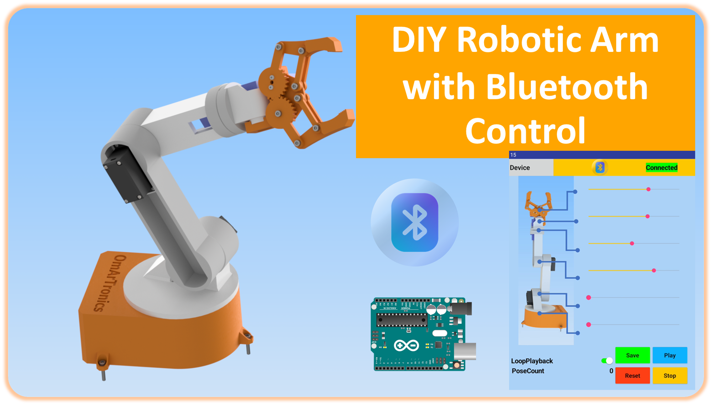

# DIY 6-DOF Robotic Arm with Bluetooth Control

This project features a DIY 6-DOF robotic arm that is controlled via Bluetooth using a custom smartphone app. The robotic arm is designed using SG90 and MG996R servos, 3D-printed components, and connected to an Arduino Uno with a PCA9685 servo driver. The arm is wirelessly controlled through a Bluetooth connection with an app built using MIT App Inventor.

## Features
- Bluetooth control of the robotic arm through a smartphone app
- Saving and replaying movement sequences
- 3D-printed components and custom assembly
- Utilizes the PCA9685 servo driver to control up to 16 servos

## Resources
- **Blog:** [DIY 6-DOF Robotic Arm with Bluetooth Control](https://omartronics.com/diy-6-dof-robotic-arm-with-bluetooth-control-design-build-and-program/)
- **Video:** [YouTube Video](https://youtu.be/op7UYowvfX0)
- **STL Files:** [Cults3D](https://cults3d.com/:2252167)

